# Scalable-and-On-Demand-Web-Server
## Overview:
Providing auto Scalable and On-Demand web server for the users. This means, we going to deploy our web server with highly available and auto-scaling the servers to the users. This is done by using AWS resources like Launch Template, Auto Scaling Groups, and Load Balancer.

We will be creating this environment in the ap-south-1(Mumbai)region.

These are the following steps to implement our web server:
- Create a Launch Template:
- Create an Auto Scaling Group:
- Set up a Load Balancer:
- Integrate Load Balancer with Auto Scaling Group:

## Technologies:
Let's discuss the cloud technologies that are necessary for our project. The below information provides an overview of the AWS resources.
#### Launch Templates: 
A launch template is similar to a launch configuration, in that it specifies instance configuration information. It includes the ID of the Amazon Machine Image (AMI), the instance type, a key pair, security groups, and other parameters used to launch EC2 instances.
#### Auto Scaling Groups:
An Auto Scaling Group (ASG) in Amazon Web Services (AWS) is a collection of Amazon EC2 instances that are grouped together for the purpose of automatic scaling and management. ASGs are a key part of the scaling process, and they can help you maintain a desired number of instances in a group.
         
         * Note: Automatic scaling of the instance by giving some input parameters to Auto Scaling Groups:
                     - %CPU performance:  90%
                     - Max Instances:     4
                     - Min Instances:     1
                     - Desired Instances: 2

#### Load Balancer: 
Elastic Load Balancing automatically distributes your incoming traffic across multiple targets, such as EC2 instances, containers, and IP addresses, in one or more Availability Zones. It monitors the health of its registered targets, and routes traffic only to the healthy targets.

                 *Note: When we create the load balancer, we must register targets.

#### Target Groups:
A target group in AWS is a component that directs traffic to registered targets, such as EC2 instances, IP addresses, containers, or Lambda functions.

## Step 1: Launch Template
Go to the console and search for <kbd>EC2</kbd> and on. click on <kbd>Launch Templete</kbd>. Creating the new template by clicking on <kbd>Cretate Launch Templete</kbd>. follow the image below.

 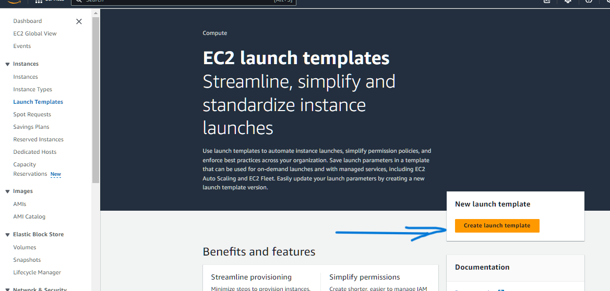

Set Up the launch template: These are the main requirements for deploying the server. 
- Name: <kbd>Tutorial_Website</kbd>
- Select AMI's: <kbd>Amazon Linux</kbd>
- Select Instance Type: <kbd>t2.micro</Kbd>
- Key Pair: <kbd>Ben10.pem</Kbd>
- Security Group: select SG, must allow ssh and HTTP, deny https
- Edit User Data: Copy and Past(or simply Upload the file),which must follow the correct commands and code indentation
click on the <kbd> Create Launch Template</kbd>

  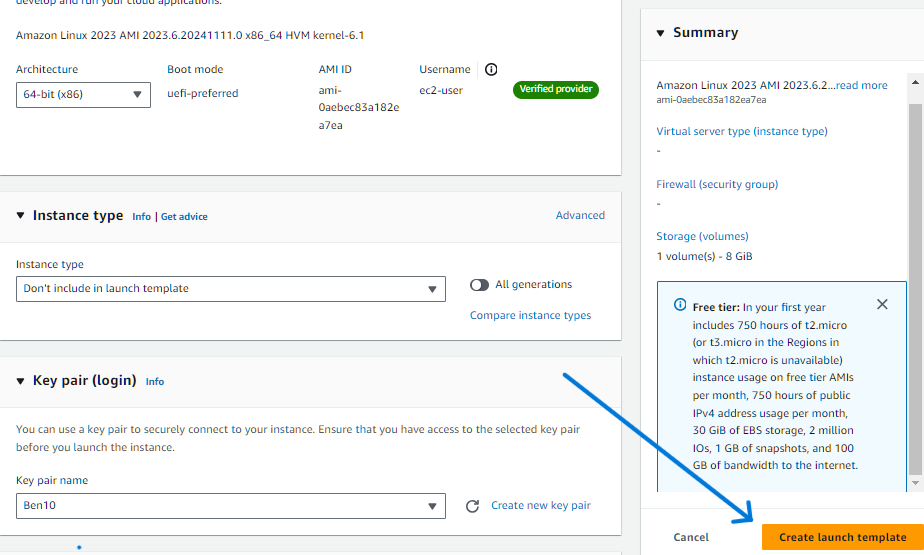

## Step 2: Auto Scaling Group
If we want to create an auto-scaling group, Go to select the Auto-scaling Groups on your bottom left side. and click on the <kbd>Create Auto Scaling Groups</kbd>

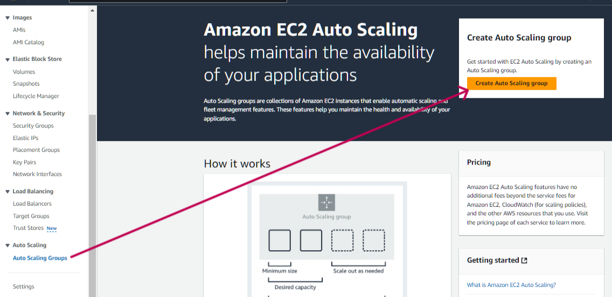

To set up the Auto Scaling Group, we need to complete the process in 7 stages:

#### 2.1. Choose Launch Template:
      - Name of Auto Scaling Group: <kbd> ASGTutorialWebsite</kbd>
      - Choose Launch Template: <kbd>Tutorial_website</kbd>
click on <kbd>Next</kbd> on right-bottom side.
#### 2.2. Choose instance launch options:
When we integrate the auto-scaling group into our webserver. Newly launched instances are automatically launched across the selected Available zones to provide low latency and High availability. In this, we going to specify the VPC and available zones to our Autoscaling groups.
     - Select VPC:<kbd>VPC ID</kbd.
     - Select Availability Zones: specifying the number of Availability Zones.

#### 2.3. Integrate with Other Services -optional:
We need to select Network configuration, to create the instance.
   - select VPC: select where we want to create the instances.
   - select subnets: select where we want to create the instances in availability zones.
     
       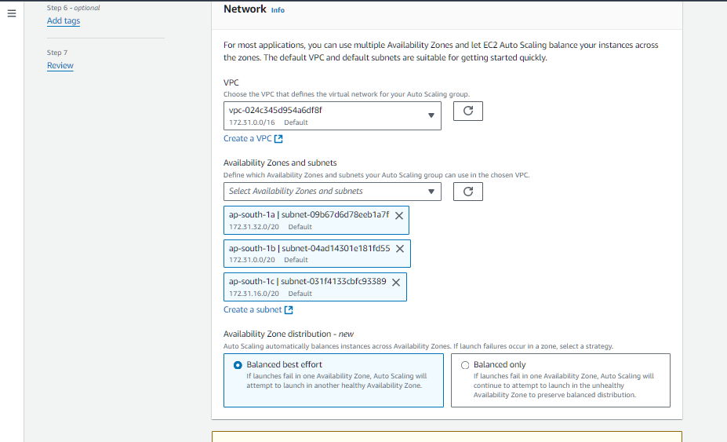
   
Here, to distribute all incoming traffic to all instances equally. We need to integrate the load balancer into our webserver(EC2 instances). So that, we can specify or create a new load balancer in this step. I am Creating the new load balancer.
   - Select Load Balancer: <kbd> Attach to a New Load Balencer</kbd>
   - Load Balancer type: <kbd>Aplication Load Balencer</kbd>
   - Name: <kbd>LaodBalencerLearnwebsite</kbd>
   - Load Balancer Scheme: <kbd>Internet-facing</kbd> (because This web server is used by the public)
     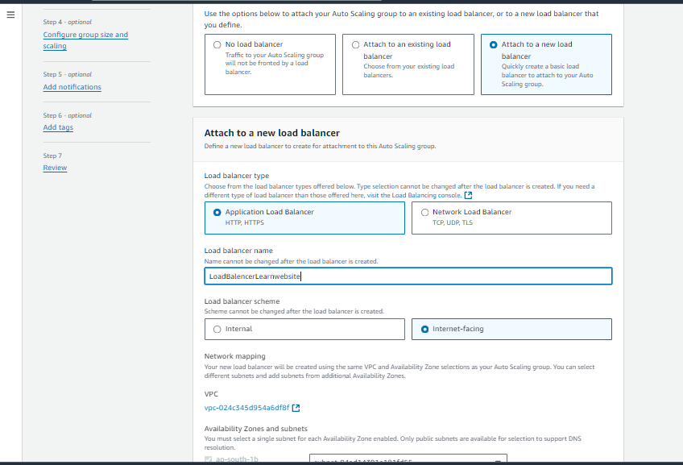
   - Select Network Configuration: Default VPC and Availability Zones are selected. We can add a new AZ to handle the high input traffic.
     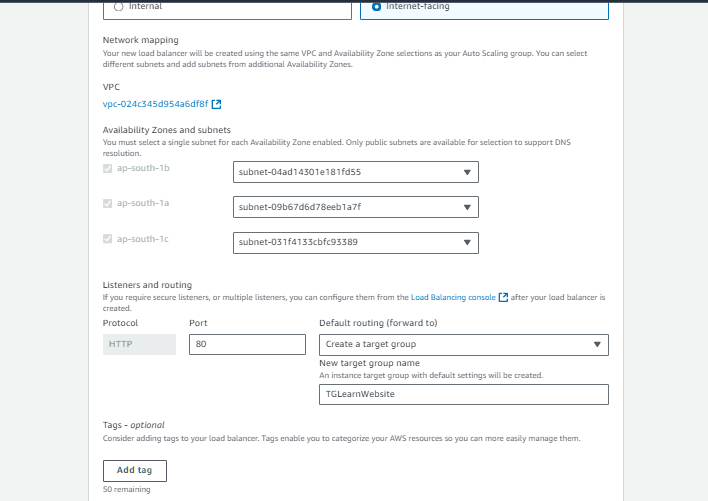
     
   - Select Target Group: select <kbd>Create a New Target Group</kbd> (Here we select already existed Target Group)
     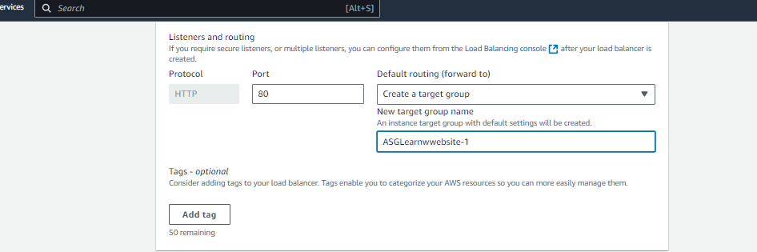
   - Select Ec2 Health Checks: Enable the check box <kbd>
Turn on Elastic Load Balancing health checks</kbd>

     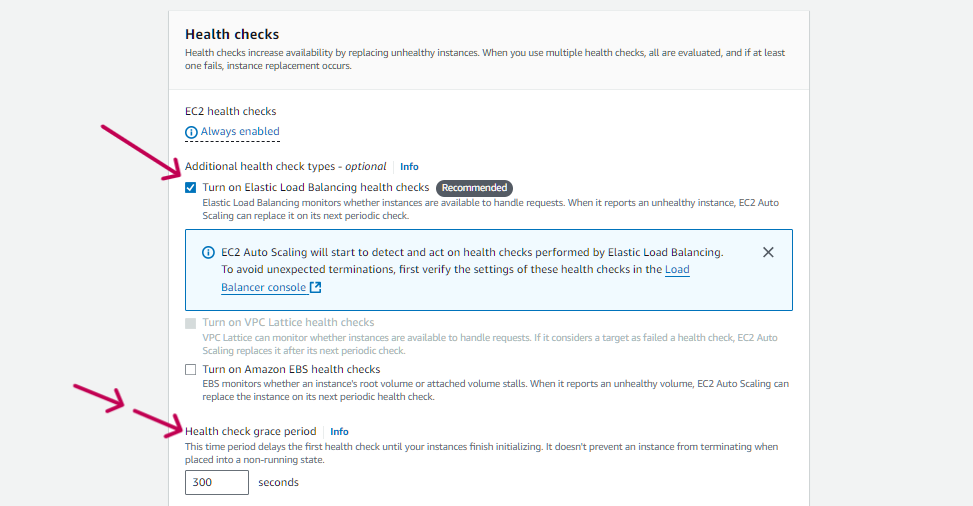
click on <kbd>Next</kbd> botten.

#### 2.4. Configure group size and scaling:

In this stage, we need to specify some input parameters and the threshold value for the auto-scaling group. Based on the parameters the instances are Scale-in and scale-out operation are done. Even if we miss the step, the default parameters are taken by the auto-scaling group. follow the given image for reference.
- Group Size: Under the Desired capacity specify <kbd>2</kbd>(This parameter used to maintain the no.of instances at normal condition)

- Scaling Limits:
- Min desired capacity: 1
- Max desired capacity: 4
 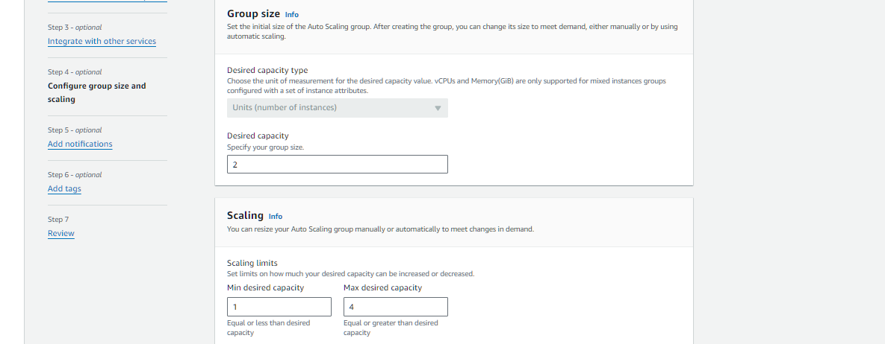

-Automatic scaling - optional: select the <kbd>Target tracking scaling policy</kbd>(Choose a CloudWatch metric and target value and let the scaling policy adjust the desired capacity in proportion to the metric's value.)
- Scaling policy name: <kbd>Target Tracking Policy</kbd>
- Metric type: select <kbd>Average CPU Utilization.</kbd>
- Target value: Enter Number <kbd> 90</kbd>(this is percentage of CPU utilization>
- Instance warmup: Warmup time for launching a new instance<kbd>120</kbd>
 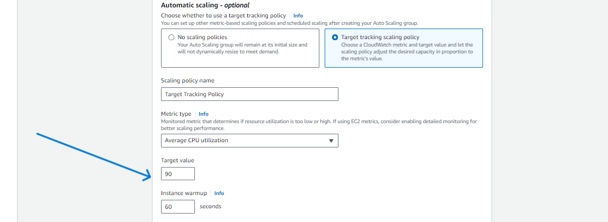

click on <kbd>Next</kbd> butten.

#### 2.5. Add notifications - optional
This is used to get notifications by using the AWS SNS service.

click on <kbd>Next</kbd> botten.

#### 2.6. Add tags - optional Info
Add tags to help you search, filter, and track your Auto Scaling group across AWS. You can also add these tags to instances when they are launched automatically.

click on <kbd>Next</kbd> botten.

#### 2.7. Review:
Cross-check all setup before creating an Auto-scaling group.

click on <kbd>Create Auto Scaling Group</kbd> botten.

***Note: Now We have created the Auto Scaling Group, Load Balancer, and Target Group.**

### Verifying Instance Created by Auto Scaling Groups:
1. While creating the instances, we have specified the Desired, Minimum, and Maximum capacity. Based on these parameters, Instances are created. We can verify instances by navigating to EC2-**instances**. At normal conditions, two EC2-instances are maintained.
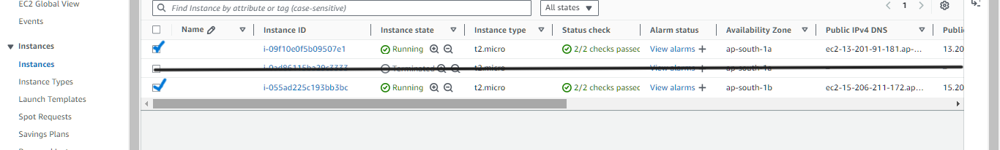

2. Check web server performance running on the above-specified instances. This can be done by using the **public IP Address**.
   
   2.1. check the first instance having IP Address <kbd> 13.201.91.181</kbd>
   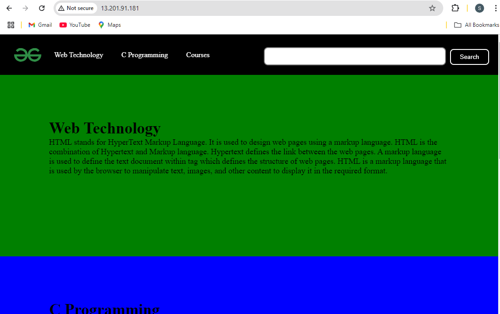

   2.2. check the second instance having IP Address <kbd>15.206.211.172</kbd>
   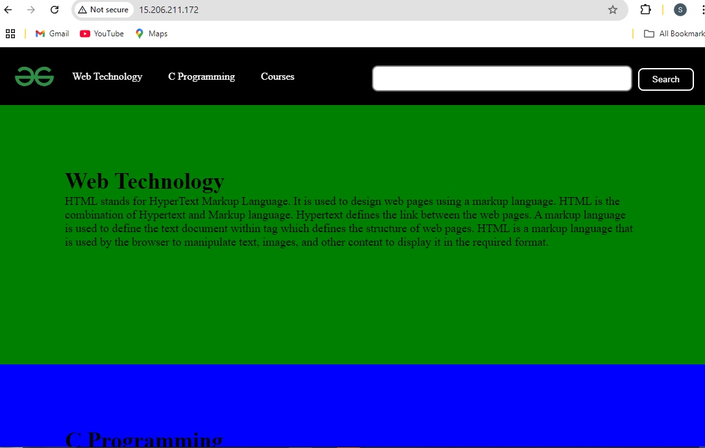

### Verifying the instance Health checks:
Target Groups automatically connect all instances to the load balancer. We can check the instance health in the target groups.
To check the Instance health, Go to Target Groups and select the <kbd>TargetGroupsASGLearnwebsite</kbd>. Scroll down to the bottom, Under the <kbd>Registered Targets</kbd> we can see the instance status.

   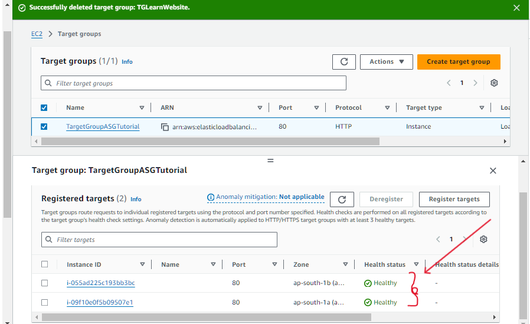

### Check Load Balancer:
Here, we can start utilizing the website  by using the <kbd>DNS Name</kbd>. Click on the LeadBalancerASGLearnwebsite</kbd>, and copy the <kbd>DNS Name</kbd>.

   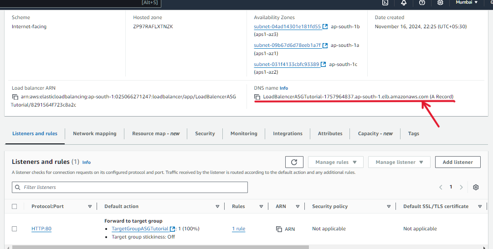

After Pasting the DNS Name into a website, we can see this:

   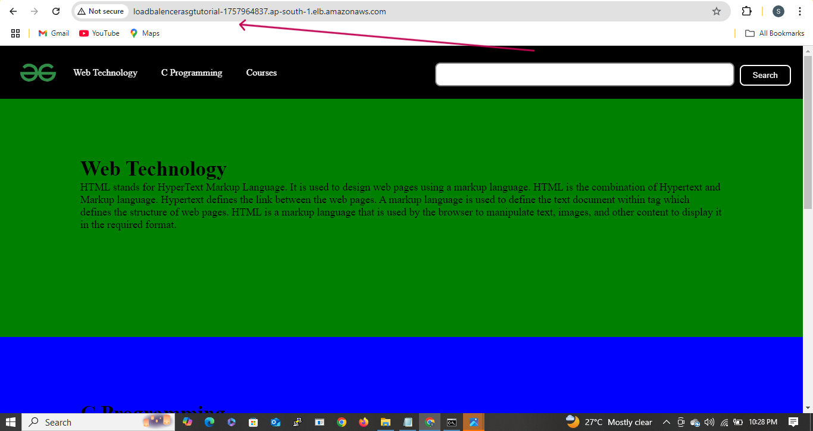

#### Successfully we have deployed the Scalable and On-Demand Webserver.

